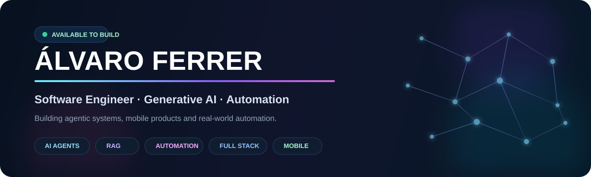

 

I build software that does things, not just demos

I’m a software engineer focused on Generative AI, AI agents, automation and product development.
My sweet spot is turning messy real-world processes into systems that can reason, coordinate, automate and still keep humans in control.

I work across the stack when the product needs it: Python / FastAPI, Next.js / React, Flutter, Supabase / PostgreSQL, APIs, n8n and LLM orchestration.

Current direction: agentic systems + automation + software products with measurable operational value.

Selected work

<table>
<tr>
<td width="50%" valign="top">

🤖 MermaOps

Multi-agent AI system for food-waste reduction

A production-minded system built around 12 AI agents + an orchestrator, with Telegram operations, a Flutter control app, FastAPI backend, Supabase Realtime and autonomous scheduled workflows.

Highlights

Multi-agent orchestration, validation and consensus

RAG + episodic memory patterns

Vision / barcode flows

Operational dashboards and reporting

Real-time mobile experience

Python FastAPI Claude Flutter Supabase AI Agents

</td>
<td width="50%" valign="top">

🧠 FreelanceOps AI

Agentic operating system for freelance workflows

A multi-agent platform designed to coordinate briefs, pricing, tasks, quality gates, approvals, versions and changing client requirements through a shared operational flow.

Highlights

7 specialized agents

Human-in-the-loop approvals

Shared state, versioning and change management

Next.js app + Neon + Better Auth

Automated validation and E2E testing

Next.js React AI Agents Neon Drizzle Playwright

</td>
</tr>

<tr>
<td width="50%" valign="top">

🛒 Smart Basket

Intelligent shopping companion built with Flutter

Mobile product focused on shopping lists, pantry organization, recommendations and smart assistance, with a large multi-screen Flutter codebase and automated testing.

Flutter Dart Firebase Mobile AI Features

</td>
<td width="50%" valign="top">

🧩 Psychology Platform

Clinical operations platform

A full-stack internal platform for patient management, reports and professional workflows, built around a modern web architecture.

Next.js TypeScript Prisma PostgreSQL

</td>
</tr>
</table>

<b>More projects</b>

 

💎 ALDARA Bisutería — modern TypeScript commerce / brand experience.

💬 Agente Conversacional — conversational agent concept for web, app and WhatsApp integrations.

🐾 PetCare — Flutter app concept focused on animal care.

What I work with

AI & Automation

 

Product Engineering

Data, Cloud & Tools

How I think about engineering

problem
   ↓
understand the workflow
   ↓
design the smallest reliable system
   ↓
automate what should be automated
   ↓
keep humans in control where it matters
   ↓
measure → learn → improve

I care about useful architecture, clear product flows and systems that survive contact with reality.
That means thinking beyond the model call: state, permissions, retries, validation, observability, data, UX and failure modes all matter.

GitHub activity

 

<picture>
  <source media="(prefers-color-scheme: dark)" srcset="https://raw.githubusercontent.com/alvaroferrer1/alvaroferrer1/output/github-contribution-grid-snake-dark.svg">
  <source media="(prefers-color-scheme: light)" srcset="https://raw.githubusercontent.com/alvaroferrer1/alvaroferrer1/output/github-contribution-grid-snake.svg">
  
</picture>

Current focus

building:
  - agentic workflows
  - AI-powered automation
  - full-stack product systems
  - Flutter mobile experiences

interested_in:
  - Generative AI
  - AI Agents
  - RAG
  - orchestration
  - developer tooling
  - applied automation

open_to:
  - AI / Automation Engineer
  - Software Engineer
  - AI Solutions / Agentic Systems
  - Flutter / Mobile roles

Build something useful with me

I’m especially interested in teams working on AI products, automation, agentic systems and software with real operational impact.

  

Zaragoza, Spain · Open to remote / hybrid opportunities

